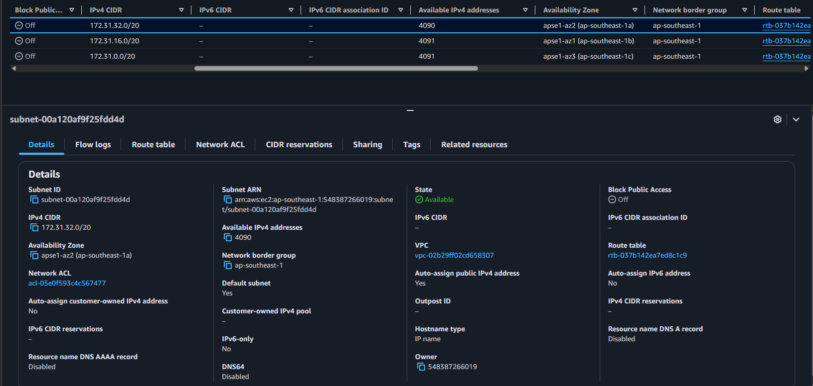
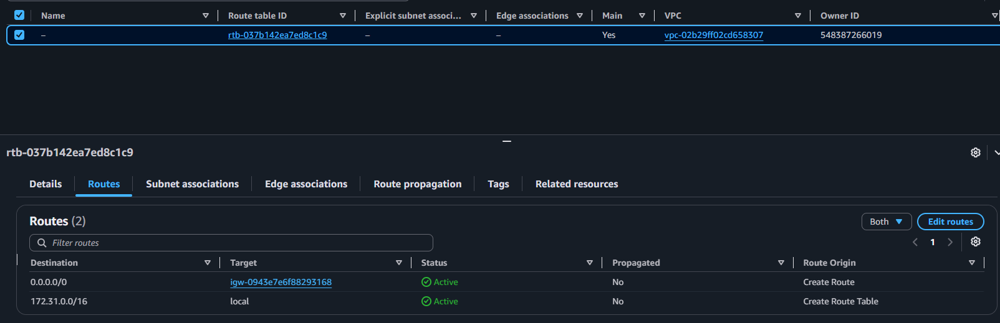
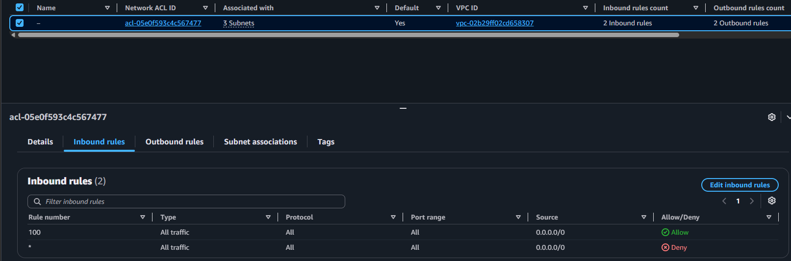
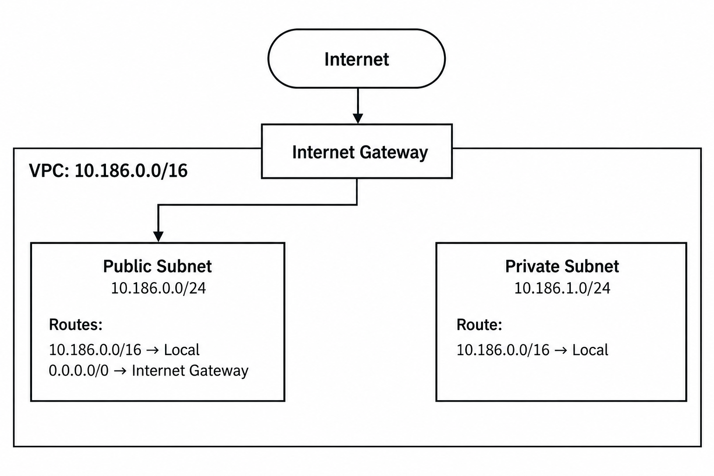

# Assignment 2 Submission

<!--
How to use this template:

1. Copy this file to submissions/assignment-2/<your-github-username>/submission.md
2. Replace every answer placeholder with your own answer. Delete the angle brackets too.
3. Save your four images in the same folder, with the exact file names below.
4. Do not write your full name or your student number in this file.
-->

## About me

- GitHub username: morense-umak
- Section: IV-DCSAD
- IAM user name that I signed in with: dcsad-g06
- X: 186

---

## Part A. Explore

### A1. The VPC

Default VPC IPv4 CIDR:

172.31.0.0/16

Number of addresses in that CIDR:

65,536

### A2. The subnets

| Availability Zone | IPv4 CIDR |
| --- | --- |
| apse1-az2 (ap-southeast-1a) | 172.31.32.0/20 |
| apse1-az1 (ap-southeast-1b) | 172.31.16.0/20 |
| apse1-az3 (ap-southeast-1c) | 172.31.0.0/20 |

Screenshot 1. 

### A3. Available addresses

Available IPv4 addresses in each subnet:

| Availability Zone | Available IPv4 addresses |
|---|---:|
| `ap-southeast-1a` | 4,090 |
| `ap-southeast-1b` | 4,091 |
| `ap-southeast-1c` | 4,091 |

Why is the number lower than 4,096?

A /20 subnet has 4,096 IP addresses. AWS reserves 5 of these addresses for network purposes, so only 4,091 addresses can be used. The number of available addresses can also go down when devices or EC2 instances use private IP addresses.

What uses the missing address in the subnet with the lowest number?

The missing address is usually being used by a network interface, such as the one connected to an EC2 instance. Even if the EC2 instance is stopped, it can still keep its private IP address.

### A4. The route table

| Destination | Target |
| --- | --- |
| 0.0.0.0/0 | igw-... |
| 172.31.0.0/16 | local |

Screenshot 2. 

### A5. Public or private

Are the default subnets public or private? Which route proves it?

The default subnets are public because their route table has a 0.0.0.0/0 route that sends internet traffic to an internet gateway.

### A6. The internet gateway

State of the internet gateway:

Attached

What happens to the default subnets if the gateway is detached?

If the internet gateway is disconnected, the resources inside the VPC will not be able to access the internet.

### A7. NAT gateways

Number of NAT gateways:

0

Can a server in a new private subnet download updates? Why?

A server in a private subnet cannot download updates from the internet because it has no direct internet connection. It needs a NAT gateway and a route that sends internet traffic through that gateway.

### A8. The network ACL

| Rule number | Source | Allow or Deny |
| --- | --- | --- |
| 100 | 0.0.0.0/0 | Allow |
| * | 0.0.0.0/0 | Deny |

How is a network ACL different from a security group?

A network ACL controls traffic going in and out of a subnet. It can allow or block traffic. A security group controls traffic for specific resources, like EC2 instances, and it only uses allow rules.

A network ACL is stateless, which means you need rules for both incoming and outgoing traffic. A security group is stateful, so if traffic is allowed in, the reply traffic is automatically allowed.

Screenshot 3. 

### A9. The default security group

Inbound rule (type and source):

Type: All traffic
  
Source: 0.0.0.0/0

Which resources can send traffic to an instance that uses it?

This inbound rule only allows traffic from resources that use the same default security group. It does not allow connections from everyone on the internet or from all resources inside the VPC.

---

## Part B. Prepare

### B1. Plan two subnets

- Public subnet CIDR: 10.186.0.0/24
- Private subnet CIDR: 10.186.1.0/24

### B2. Route tables

Route table of the public subnet:

| Destination | Target |
| --- | --- |
| 10.186.0.0/16 | local |
| 0.0.0.0/0 | internet gateway |

Route table of the private subnet:

| Destination | Target |
| --- | --- |
| 10.186.0.0/16 | local |

### B3. My VPC diagram

Tool used (Excalidraw, draw.io, Lucidchart, or paper):

draw.io

### B4. Predict a change

Can you still open the web page from your laptop? Why?

No. If the `0.0.0.0/0` route is removed, the instance will not be able to connect to the internet. Having a public IPv4 address is not enough because it still needs a route to the internet gateway.

Can the instance still reach another instance in the VPC? Why?

Yes. The instances can still communicate using their private IP addresses as long as the security groups and network ACLs allow it. The VPC’s local route is still there, so internal communication will continue to work.

### B5. Place a database

Which subnet gets the database? Why?

I would put the database in the private subnet, `10.186.1.0/24`, because it does not have a direct route to the internet. The application can still connect to the database using the VPC’s private network. Security groups can also be used so only the needed application resources can access the database.

### B6. My question about VPCs

What is your question, and what made you think of it?

To keep the system working if one Availability Zone fails, we should use two Availability Zones. Each zone should have its own public and private subnet. The application and database should be spread across both zones. If one zone fails, the other zone can still keep the system running.
